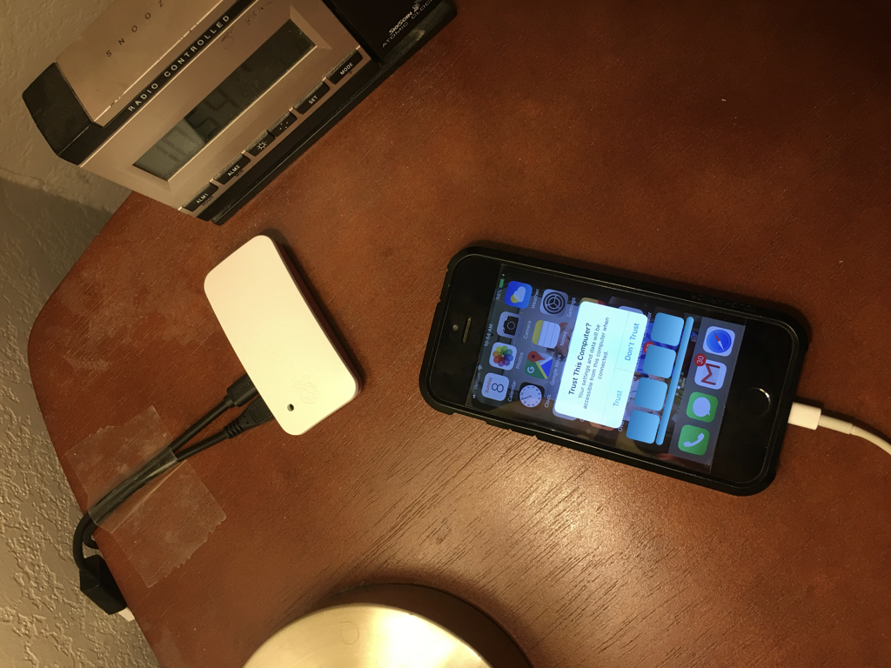
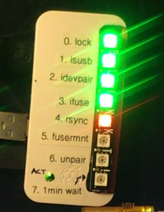
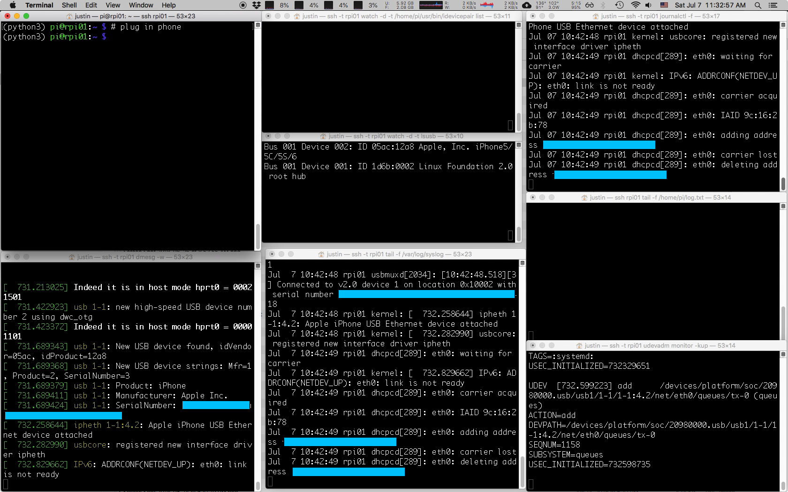

# Raspberry Pi for iPhone backup

You can use a Raspberry Pi (even a tiny RPi Zero) to backup your iphone. You plug the phone into the RPi at night, and the RPi charges it and copies its photos, music, etc onto the RPi's micro-SD card.

(Note: Consider having your router disallow the RPi on the WAN, since you're just using it for iphone backup.)

You can show backup progress with a [Blinkt LED strip](https://www.adafruit.com/product/3195):

## Table of Contents

- [Introduction](#introduction)
    - [Troubleshooting tip](#troubleshooting-tip)
- [0. Install files from this repo](#0-install-files-from-this-repo)
- [1. Install `libimobiledevice` from source](#1-install-libimobiledevice-from-source)
- [2. Plug, pair, and mount iPhone](#2-plug-pair-and-mount-iphone)
    - [2a. Plug in phone](#2a-plug-in-phone)
    - [2b. Pair phone to RPi](#2b-pair-phone-to-rpi)
    - [2c. Mount phone's files on RPi](#2c-mount-phones-files-on-rpi)
    - [2d. Back up phone to RPi](#2d-back-up-phone-to-rpi)
    - [2e. Unmount, Unpair, Unplug](#2e-unmount-unpair-unplug)
- [3. Run the backup script](#3-run-the-backup-script)
- [4. Configure udev to run the backup script upon the phone plug-in event](#4-configure-udev-to-run-the-backup-script-upon-the-phone-plug-in-event)
    - [4a. udev example](#4a-udev-example)
    - [4b. Set up our own udev rule to run backup script upon plug-in](#4b-set-up-our-own-udev-rule-to-run-backup-script-upon-plug-in)
- [5. Ensuring `udev` is configured correctly at boot](#5-ensuring-udev-is-configured-correctly-at-boot)
- [6. Indicate progress with Blinkt LEDs](#6-indicate-progress-with-blinkt-leds)
- [Appendix: Troubleshooting](#appendix-troubleshooting)
- [Appendix: Notes / Resources](#appendix-notes-and-resources)

# Introduction

Accessing an iPhone's data from a Raspberry Pi is harder than you'd expect. The Raspbian OS doesn't seem to support it by default: the `apt-get install` versions of the iPhone-mounting software `libimobiledevice6` and `ifuse` did not work for my phone running iOS 11.4. So I followed [samrocketman's instructions](https://gist.github.com/samrocketman/70dff6ebb18004fc37dc5e33c259a0fc) for installing `libimobiledevice` and `ifuse` from source. Here are his instructions with my additions.

Also, I wanted the RPi to download the iPhone's data as soon as I plugged it in. I did not want to have to ssh into the RPi to initiate the backup. This required setting up a `udev` rule. It was hard to get it configured just right.

Lastly, there is one lingering problem I haven't solved:

In order to pair the phone to the RPi, the `backup-iphone.py` script (from this repo) uses the command `$ idevicepair pair`. It seems that for this command to succeed, it requires two things:

1. the phone must be unlocked
2. the phone must "Trust" the RPi

So, each time you plug in the iPhone to the RPi, you should:

1. unlock the phone,
2. wait for the "Trust this computer?" dialog to appear on the phone (sometimes takes 20 seconds to appear),
3. click "Trust" and enter passcode.
4. Keep the screen unlocked for 15 seconds.

After you click "Trust", it is okay for the phone to re-lock and turn off its display.

For some reason the phone doesn't remember the RPi, so you must do this each time.

If everything is set up correctly, the `backup-iphone.py` script will start to run as soon as you plug in the phone. It tries to pair for about 30 seconds before it gives up, so you've got 30 seconds to remember to unlock the phone and click "Trust".

## Troubleshooting tip

To help debug problems, try running `monitor.sh` on a Mac that can ssh into the Pi. It opens several terminal windows on the Mac that monitor various aspects of the USB-device manager and whether the phone is plugged in and paired.

(The script `monitor.sh` assumes your `~/.ssh/config` file defines an ssh alias `rpi42` for sshing into the Pi.)

- `watch -d -t lsusb` tells you when the phone is plugged in
- `dmesg -w` gives you kernel messages
- `tail -f /var/log/syslog` watches the syslog
- `journalctl -f` watches the `systemd` journal
- `udevadm monitor -kup` tells you what `udev` does when you plug in the phone
- `watch -d -t /home/pi/usr/bin/idevicepair list` tells you when the phone is paired
- `tail -f /home/pi/log.txt` shows the log that the `/home/pi/backup-iphone.sh` script writes to

If `monitor.sh` doesn't work for you, consider using this bash snippet (for Mac). It runs each of these commands in its own terminal window on the RPi over ssh.

The snippet assumes your `~/.ssh/config` file defines the alias `rpi01` to let you ssh into the RPi.

    REPLACE_STRINGS=( \
    '' \
    'dmesg -w' \
    'watch -d -t lsusb' \
    'watch -d -t /home/pi/usr/bin/idevicepair list' \
    'tail -f /var/log/syslog' \
    'tail -f /home/pi/log.txt' \
    'journalctl -f' \
    'udevadm monitor -kup' ) # no trailing newline.
    for cmd in "${REPLACE_STRINGS[@]}"
    {
        osascript -e "tell application \"Terminal\" to do script \"ssh -t rpi01 $cmd\""
    }

# 0. Install files from this repo

    sudo ln -s /home/pi/Raspberry-Pi-for-iPhone-Backup/etc/udev/rules.d/lol.rules /etc/udev/rules.d/lol.rules
    ln -s /home/pi/Raspberry-Pi-for-iPhone-Backup/home/pi/udev-runs-this.sh /home/pi/udev-runs-this.sh
    ln -s /home/pi/Raspberry-Pi-for-iPhone-Backup/home/pi/backup-iphone.sh  /home/pi/backup-iphone.sh
    ln -s /home/pi/Raspberry-Pi-for-iPhone-Backup/home/pi/backup-iphone.py  /home/pi/backup-iphone.py
    ln -s /home/pi/Raspberry-Pi-for-iPhone-Backup/home/pi/leds.pickle /home/pi/leds.pickle
    ln -s /home/pi/Raspberry-Pi-for-iPhone-Backup/home/pi/leds_OFF.pickle /home/pi/leds_OFF.pickle

- `lol.rules` tells `udev` to run `udev-runs-this.sh` when the iPhone is plugged in
- `udev.runs.this.sh` runs `backup-iphone.sh`
- `backup-iphone.sh` sets up some environment variables and calls the main script `backup-iphone.py`.
- `backup-iphone.py` uses `idevicepair`, `ifuse`, and `rsync` to pair with, mount, and backup the iPhone.

In the next section, we build `idevicepair` and friends from source.

# 1. Install `libimobiledevice` from source

In this section we `git clone` the `libimobiledevice` software and friends.

However, before we do that, we do a little hack to install a user named `usbmux` that is required by a subsystem within `libimobiledevice`.

The `usbmuxd` daemon is part of `libimobiledevice`; it multiplexes connections over USB to an iOS device. For safety, it runs as a user named `usbmux` with certain (limited?) permissions. It expects the `usbmux` user to exist or it will fail to start. Unfortunately, when you build `usbmuxd` from source, it doesn't create the `usbmux` user. However, `apt-get install`ing the `usbmuxd` package *does* create the `usbmux` user, and `apt-get remove`ing  `usbmuxd` removes the package but doesn't delete the `usbmux` user. (However, we can't simply use `apt-get`'s version of `usbmux` because the Raspbian repos have old versions of `usbmuxd` and `libimobiledevice` that won't work with iOS 11). So before we build `usbmux` from source, we use `apt-get install` then `apt-get remove` to create the `usbmux` user.

See if you have the `usbmux` user:

    grep usb /etc/passwd

If not, install `usbmuxd` with `apt-get` to force the creation of the `usbmux` user:

    sudo apt-get install usbmuxd

Now you should have the `usbmux` user:

    grep usb /etc/passwd

    usbmux:x:112:46:usbmux daemon,,,:/var/lib/usbmux:/bin/false

Remove packages that we're going to build from source:

    sudo apt-get remove libimobiledevice6 ifuse usbmuxd

Verify you still have the `usbmux` user.

**REBOOT**

Now we are ready to install `libimobiledevice` and friends from source.

Add to your `.bashrc` some config that lets us build code in `~/usr` :

    [ ! -d "$HOME/usr/src" ] && mkdir -p "$HOME/usr/src"
    export PKG_CONFIG_PATH="${HOME}/usr/lib/pkgconfig:${PKG_CONFIG_PATH}"
    export CPATH="${HOME}/usr/include:${CPATH}"

    export MANPATH="${HOME}/usr/share/man:${MANPATH}"

    export PATH="${HOME}/usr/bin:${PATH}"
    export LD_LIBRARY_PATH="${HOME}/usr/lib:${LD_LIBRARY_PATH}"

Don't forget to

    source ~/.bashrc

to take effect.

Install packages:

    sudo apt-get install -y build-essential git

    sudo apt-get install automake libtool pkg-config libplist-dev libplist++-dev python-dev libssl-dev libusb-1.0-0-dev libfuse-dev

Get source:

    mkdir -p ~/usr/src
    cd ~/usr/src
    for x in libplist libusbmuxd usbmuxd libimobiledevice ifuse; do git clone https://github.com/libimobiledevice/${x}.git;done

Build sources (order matters):

    cd ~/usr/src/libplist
    ./autogen.sh --prefix="$HOME/usr"
    make && make install
    cd ~/usr/src/libusbmuxd
    ./autogen.sh --prefix="$HOME/usr"
    make && make install
    cd ~/usr/src/libimobiledevice
    ./autogen.sh --prefix="$HOME/usr"
    make && make install
    cd ~/usr/src/usbmuxd
    ./autogen.sh --prefix="$HOME/usr"
    make && sudo make install

Can't paste subsequent lines with the first block because it'll give subsequent lines as pw attempts to `sudo`.

    cd ~/usr/src/ifuse
    ./autogen.sh --prefix="$HOME/usr"
    make && make install

Verify `ifuse` and `idevicepair` resolve to your new versions in `~/usr/bin/`:

    type -P ifuse         # should be /home/pi/usr/bin/ifuse
    type -P idevicepair   # should be /home/pi/usr/bin/idevicepair

**REBOOT**

We're finished installing the necessary software.

# 2. Plug, pair, and mount iPhone

Tips:

- If any of these steps fail, consider restarting `usbmuxd` and `udev` like so:

        sudo service usbmuxd restart
        sudo service udev restart

- Normally, the `usbmuxd` service isn't started on boot: `sudo service usbmuxd status` shows `Active: inactive (dead)`. However, once you plug in the phone, `sudo service usbmuxd status` will show

        (python3) pi@rpi01:~ $ sudo service usbmuxd status
        ● usbmuxd.service - Socket daemon for the usbmux protocol used by Apple devices
           Loaded: loaded (/lib/systemd/system/usbmuxd.service; static; vendor preset: enabled)
           Active: active (running) since Wed 2018-07-04 07:40:06 PDT; 4s ago
             Docs: man:usbmuxd(8)
         Main PID: 968 (usbmuxd)
           CGroup: /system.slice/usbmuxd.service
                   └─968 /home/pi/usr/sbin/usbmuxd --user usbmux --systemd

## 2a. Plug in phone

Plug the iPhone into the RPi's USB port. (Note the RPi Zero has micro-USB ports for both power and data; plug the phone into the data port.)

Running `dmesg` shows the USB driver at least recognizes it:

    (python3) pi@rpi01:~ $ dmesg -wH
    [Jul 4 07:43] dwc_otg_handle_wakeup_detected_intr lxstate = 2
    [  +0.506597] usb 1-1.3: new high-speed USB device number 3 using dwc_otg
    [  +0.133126] usb 1-1.3: New USB device found, idVendor=05ac, idProduct=12a8
    [  +0.000025] usb 1-1.3: New USB device strings: Mfr=1, Product=2, SerialNumber=3
    [  +0.000012] usb 1-1.3: Product: iPhone
    [  +0.000010] usb 1-1.3: Manufacturer: Apple Inc.
    [  +0.000010] usb 1-1.3: SerialNumber: XXXXXXXXXXXXXXXXXXXXXXXXXXXXXXXXXXXXXXXX
    [  +0.258682] ipheth 1-1.3:4.2: Apple iPhone USB Ethernet device attached
    [  +0.011945] usbcore: registered new interface driver ipheth
    [  +0.348555] IPv6: ADDRCONF(NETDEV_UP): eth0: link is not ready

Unlock the phone and wait 10-20 secs for the phone to ask you to Trust the computer. Click "Trust" on the phone and enter passcode (or `idevicepair pair` will fail).

## 2b. Pair phone to RPi

    (python3) pi@rpi01:~ $ idevicepair pair
    SUCCESS: Paired with device XXXXXXXXXXXXXXXXXXXXXXXXXXXXXXXXXXXXXXXX

## 2c. Mount phone's files on RPi

We'll mount the iphone at `~/usr/mnt`.

    mkdir -p ~/usr/mnt
    ifuse ~/usr/mnt

Now the iPhone's files are mounted:

    (python3) pi@rpi01:~ $ ls ~/usr/mnt
    AirFair  CloudAssets  Downloads       LoFiCloudAssets  PhotoData  Podcasts       Purchases  Recordings  Vibrations
    Books    DCIM         iTunes_Control  MediaAnalysis    Photos     PublicStaging  Radio      Safari

## 2d. Back up phone to RPi

    mkdir ~/iphone-backups
    rsync -v -a ~/usr/mnt ~/iphone-backups

## 2e. Unmount, Unpair, Unplug

    fusermount -u ~/usr/mnt
    idevicepair --debug unpair

# 3. Run the backup script

The file `/home/pi/backup-iphone.py` contains a Python3 script that detects the phone with `lsusb`, pairs the phone to the RPi with `idevicepair pair`, mounts it with `ifuse` to `/home/pi/usr/mnt/`, and copies everything (or, everything that `libimobiledevice` makes availble) to the RPi's micro-SD card at `/home/pi/iphone-backups/` with `rsync`.

(Verify `backup-iphone.py` is executable.)

Run `/home/pi/backup-iphone.sh`, which calls the Python script `backup-iphone.py`, and watch its logfile with `tail -f /home/pi/log.txt`.

# 4. Configure udev to run the backup script upon the phone plug-in event

Now we configure the RPi to run the `backup-iphone.sh` script whenever the phone plugs into the RPi.

Raspbian Linux currently (July 2018) uses the `udev` system (a part of the `systemd` init system) to run user scripts when users plug in hardware devices.

## 4a. udev example

When you plug in the phone, the `udev` system runs all its "rule" files in `/lib/udev/rules.d` (for system rules) and `/etc/udev/rules.d` (for user-supplied rules) and finds the file

    /lib/udev/rules.d/39-usbmuxd.rules

which contains the line

    SUBSYSTEM=="usb", ENV{DEVTYPE}=="usb_device", ENV{PRODUCT}=="5ac/12[9a][0-9a-f]/*", ACTION=="add", ENV{USBMUX_SUPPORTED}="1", ATTR{bConfigurationValue}="0", OWNER="usbmux", ENV{SYSTEMD_WANTS}="usbmuxd.service"

which specifes that when the iPhone's product number is added (`lsusb` shows the phone's `vendorId:productId` as `05ac:12a8`), `systemd` should execute the file

    /lib/systemd/system/usbmuxd.service

which contains the line

    ExecStart=/home/pi/usr/sbin/usbmuxd --user usbmux --systemd

which is the command to run the `usbmuxd` daemon. Wow!

## 4b. Set up our own udev rule to run backup script upon plug-in

Make a new `udev` rules file

    /etc/udev/rules.d/lol.rules

that contains

    SUBSYSTEM=="usb", ENV{DEVTYPE}=="usb_device", ENV{PRODUCT}=="5ac/12[9a][0-9a-f]/*", ACTION=="add", RUN+="/bin/bash /home/pi/udev-runs-this.sh"

Ensure `/home/pi/udev-runs-this.sh` is executable.

Restart the `udev` daemon so it picks up your new script:

    sudo service udev restart
    sudo service usbmuxd restart   # for good measure

Now, when the phone is plugged in, `udev` runs `/home/pi/udev-runs-this.sh`, which contains the line

    echo "/bin/su -c '/home/pi/backup-iphone.sh >> /home/pi/log.txt 2>&1' pi" | at now

which runs the `backup-iphone.sh` script as the `pi` user.

Notes:

- By default the udev task is run w/ some weird user/group, so we use `su` to run `backup-iphone.sh` as the normal user `pi`. If you forget this, rsync will give weird user/group permissions to your backed-up files and even the mount folder `~/usr/mnt` will have weird permissions.

- The `| at now` is a workaround for the requirement that `udev` jobs must exit quickly so as not to slow down the `udev` system. Since our backup script may run a long time, we disconnect it from `udev` by piping it to `at` which starts it in a separate (non-child?) process.

- **Important**: `at` isn't in Raspbian by default so you should install it:

        sudo apt-get install at

# 5. Ensuring `udev` is configured correctly at boot

There is some problem with `usbmuxd` and `udev` not initializing after a reboot: you have to `sudo service udev restart` or the udev script `/etc/udev/rules.d/lol.rules` will fail when you plug your phone in, logging to `journalctl -f` the error

    Jul 07 12:34:53 rpi01 systemd-udevd[1078]: Process '/bin/bash /home/pi/udev-runs-this.sh' failed with exit code 1.

To get around this, add the line

    service udev restart
    service usbmuxd restart

to

    /etc/rc.local

which causes `systemd` to restart `udev` and `usbmuxd` after every change in runlevel. This is probably overkill, but it ensures `udev` and `usbmuxd` are running correctly after a reboot. The alternative is sshing in and running `sudo service udev restart` (and also for `usbmuxd`) after a reboot manually -- ugh.

# 6. Indicate progress with Blinkt LEDs

Buy LED strip from Adafruit: <https://www.adafruit.com/product/3195>

Install Blinkt: run `home/pi/blinkt.sh` from this repo, or download it yourself:

    curl https://get.pimoroni.com/blinkt | bash

Test: Set 0th LED to white (RGB=255,255,255), brightness=.1 (0 to 1)

    python2 -c 'from blinkt import set_pixel, show, clear ; import time ; set_pixel(0,255,255,255,.1) ; show() ; time.sleep(2) ; clear()'

Note: Brightness has only 32 possible values, so setting brightness to anything below `1/32 = 0.03125` rounds it to 0 and turns it off.

<https://github.com/pimoroni/blinkt>
<http://docs.pimoroni.com/blinkt/>

# Appendix: Troubleshooting

## Build error "No package 'libusbmuxd-2.0' found" (or libplist) when building idevicepair

Running

    pi@rpi42:~/usr/src/libusbmuxd $ ./autogen.sh

produces error:

    configure: error: Package requirements (libusbmuxd-2.0 >= 2.0.2) were not met:

    No package 'libusbmuxd-2.0' found

    Consider adjusting the PKG_CONFIG_PATH environment variable if you
    installed software in a non-standard prefix.

This doesn't fix it:

    PKG_CONFIG_PATH=/home/pi/usr/lib/pkgconfig:/usr/lib/arm-linux-gnueabihf/pkgconfig: ./autogen.sh --prefix="$HOME/usr"

This fixes it (was missing `libplist`!)

    for x in libplist libusbmuxd usbmuxd libimobiledevice ifuse; do git clone https://github.com/libimobiledevice/${x}.git;done

Then later, build `libplist`:

    cd ~/usr/src/libplist
    ./autogen.sh --prefix="$HOME/usr"
    make && make install

## usbmuxd should've installed these

The `.rules` file that `udev` runs upon iphone plug-in:

    (python3) pi@rpi01:~ $ cat /lib/udev/rules.d/39-usbmuxd.rules
    # usbmuxd (Apple Mobile Device Muxer listening on /var/run/usbmuxd)

    # systemd should receive all events relating to device
    SUBSYSTEM=="usb", ENV{DEVTYPE}=="usb_device", ENV{PRODUCT}=="5ac/12[9a][0-9a-f]/*", TAG+="systemd"

    # Initialize iOS devices into "deactivated" USB configuration state and activate usbmuxd
    SUBSYSTEM=="usb", ENV{DEVTYPE}=="usb_device", ENV{PRODUCT}=="5ac/12[9a][0-9a-f]/*", ACTION=="add", ENV{USBMUX_SUPPORTED}="1", ATTR{bConfigurationValue}="0", OWNER="usbmux", ENV{SYSTEMD_WANTS}="usbmuxd.service"

    # Make sure properties don't get lost when bind action is called
    SUBSYSTEM=="usb", ENV{DEVTYPE}=="usb_device", ENV{PRODUCT}=="5ac/12[9a][0-9a-f]/*", ACTION=="bind", ENV{USBMUX_SUPPORTED}="1", OWNER="usbmux", ENV{SYSTEMD_WANTS}="usbmuxd.service"

    # Exit usbmuxd when the last device is removed
    SUBSYSTEM=="usb", ENV{DEVTYPE}=="usb_device", ENV{PRODUCT}=="5ac/12[9a][0-9a-f]/*", ACTION=="remove", RUN+="/home/pi/usr/sbin/usbmuxd -x"

Note the line `ENV{SYSTEMD_WANTS}="usbmuxd.service"`, which tells `systemd` to run:

    (python3) pi@rpi01:~ $ cat /lib/systemd/system/usbmuxd.service
    [Unit]
    Description=Socket daemon for the usbmux protocol used by Apple devices
    Documentation=man:usbmuxd(8)

    [Service]
    ExecStart=/home/pi/usr/sbin/usbmuxd --user usbmux --systemd
    PIDFile=/home/pi/usr/var/run/usbmuxd.pid

## debug usbmuxd with -vvv

<https://github.com/libimobiledevice/usbmuxd/issues/26>

    sudo /usr/local/sbin/usbmuxd -u -U usbmux -vvv -f

Or: add `-vvv` to the `systemd` service that runs `usbmuxd`:

    (python3) pi@rpi01:~ $ cat /lib/systemd/system/usbmuxd.service
    [Unit]
    Description=Socket daemon for the usbmux protocol used by Apple devices
    Documentation=man:usbmuxd(8)

    [Service]
    ExecStart=/home/pi/usr/sbin/usbmuxd --user usbmux --systemd -vvv
    PIDFile=/home/pi/usr/var/run/usbmuxd.pid

Now `usbmuxd` runs verbosely:

    (python3) pi@rpi01:~ $ sudo service usbmuxd start
    (python3) pi@rpi01:~ $ service usbmuxd status
    ● usbmuxd.service - Socket daemon for the usbmux protocol used by Apple devices
       Loaded: loaded (/lib/systemd/system/usbmuxd.service; static; vendor preset: enabled)
       Active: active (running) since Sat 2018-07-07 10:09:00 PDT; 6s ago
         Docs: man:usbmuxd(8)
     Main PID: 2291 (usbmuxd)
       CGroup: /system.slice/usbmuxd.service
               └─2291 /home/pi/usr/sbin/usbmuxd --user usbmux --systemd -vvv

## "libimobiledevice.so not found" error

The `LD_LIBRARY_PATH` environment variable should include `/home/pi/usr/lib/`. I fixed this by putting the line

    export LD_LIBRARY_PATH=/home/pi/usr/lib

in `backup-iphone.sh`.

## "idevicepair: command not found" error

Probably `/home/pi/usr/bin` is not in the `PATH`. I fixed this by putting

    export PATH=/usr/local/sbin:/usr/local/bin:/sbin:/bin:/usr/sbin:/usr/bin:/home/pi/usr/bin

in `backup-iphone.sh`.

I suspect the problem occurred because my `udev-runs-this.sh` wasn't using `su pi` to run the script. Also I think there's an option to `su` to run the cmd from a login shell, which should execute `pi`'s `.bashrc` file, which we defined the env vars in earlier.

## Other "not found" or "no device or filename" errors

Debug tip: in `backup-iphone.sh` and `udev-runs-this.sh`, dump ENV to log, see what user, `PATH`, `LD_LIBRARY_PATH` you have:

    env >> /home/pi/log.txt

## Phone doesn't charge when plugged in to RPi

Problem: iphone buzzes twice and appears to not be charging. It's like it tries to negotiate with the rpi but fails so disconnects entirely.

Solution: from `sudo service usbmuxd status`, it said it couldn't find a usbmux user. I apt-get installed usbmuxd to force the creation of the user, then apt-get removed it and built it again from source.

## test that udev would run `udev-runs-this.sh`

Check that udev will run the `udev-runs-this.sh` script:

Plug in phone

    sudo udevadm test --action="add" /sys/devices/platform/soc/20980000.usb/usb1/1-1/

Note: look at `journalctl -f` or `udevadm monitor -kup` when you plug in the phone to find this weird `/sys/devices/...` location where the sysfs entry for the phone lives.

Verify your udev rule appears:

    Reading rules file: /lib/udev/rules.d/10-local-rpi.rules
    ...
    Reading rules file: /etc/udev/rules.d/lol.rules   <-------- this line should be there
    ...
    run: '/bin/bash /home/pi/udev-runs-this.sh'   <------ this too
    ...

If these are present, `udev` should execute the `udev-runs-this.sh` script.

## Lots of usbmuxd clients?

Seems like lots clients connecting to usbmuxd. Can't tell which one is pairing w phone after my script stops.

# Appendix: Notes and Resources

- https://hackaday.com/2009/09/18/how-to-write-udev-rules/
- https://askubuntu.com/questions/581810/iphone-does-not-unmount-properly-when-unplugged
- https://github.com/libimobiledevice/usbmuxd/issues/26
- https://raspberrypi.stackexchange.com/questions/19600/is-there-a-way-to-automatically-activate-a-script-when-a-usb-device-connects
- https://unix.stackexchange.com/questions/28548/how-to-run-custom-scripts-upon-usb-device-plug-in

<https://github.com/libimobiledevice/usbmuxd/issues/60>

"Usbmuxd do not start when iOS device connected to USB port (udev rule added as 39-usbmuxd.rules in /lib/udev/rules.d)
usbmuxd recompiled with --without-systemd fixed the issue"

Let's see if that's the case for us.

looks like `service usbmuxd status` shows it running after plugin phone.

<https://askubuntu.com/questions/401390/running-a-script-on-connecting-usb-device>

"1.Script was not running because it needed sudo rights to run.."

    pi  ALL=(ALL) NOPASSWD: /home/pi/my_script.sh

<https://askubuntu.com/questions/284224/autorun-a-script-after-i-plugged-or-unplugged-a-usb-device>

You'll need 5 (five) files for such a USB device as follows, simply filling in respective values <fortheseparts>:

    /etc/udev/rules.d/00-usb-<yourdevice>.rules

    ACTION=="add", ATTRS{idVendor}=="<yourvendorid>", ATTRS{idProduct}=="<yourproductid>", ENV{XAUTHORITY}="/home/<user>/.Xauthority", ENV{DISPLAY}=":0", OWNER="<user>", RUN+="/usr/local/bin/usb-<yourdevice>-in_udev"
    ACTION=="remove", ATTRS{idVendor}=="<yourvendorid>", ATTRS{idProduct}=="<yourproductid>", ENV{XAUTHORITY}="/home/<user>/.Xauthority", ENV{DISPLAY}=":0", OWNER="<user>", RUN+="/usr/local/bin/usb-<yourdevice>-out_udev"

(... 4 other files)

<https://askubuntu.com/questions/25071/how-to-run-a-script-when-a-specific-flash-drive-is-mounted?rq=1>

Start by finding your device in lsusb. Note the ID (eg 0a81:0101)

Create a new udev rules file in /etc/udev/rules.d/ via sudoedit /etc/udev/rules.d/100-mount-videos.rulesand plonk a new rule in there like this:

    ACTION=="add", ATTRS{idVendor}=="0a81", ATTRS{idProduct}=="0101", RUN+="/home/your_username/bin/mount_videos.sh"

A simple mount command should work. You might need a sleep 5 command in there to wait for the filesystem to initialize

Addition from Allan: Long running scripts might block "all further events for this or a dependent device". My Mint man page further states "Long running tasks need to be immediately detached from the event process itself." No tip is given on where to gain the skill to do this.

Or `systemd`:

There's much nicer solution with systemd now. You create a service which depends and is wanted by you media e.g.: /etc/systemd/system/your.service

    [Unit]
    Description=My flashdrive script trigger
    Requires=media-YourMediaLabel.mount
    After=media-YourMediaLabel.mount

    [Service]
    ExecStart=/home/you/bin/triggerScript.sh

    [Install]
    WantedBy=media-YourMediaLabel.mount

Then you have to start/enable the service:

    sudo systemctl start your.service
    sudo systemctl enable your.service

After mount systemd fires your trigger script. The advantage over udev rule is that the script really fires after mount, not after adding system device.

Use case: I have a crypted partition which I want to backup automatically. After adding the device I have to type-in password. If I hooked the backup script to udev, the script attempts to run at the time when I'm typing password, which will fail.

Resource: Scripting with udev

Note: You can find your device unit with:

    sudo systemctl list-units -t mount

<https://github.com/libimobiledevice/usbmuxd/blob/master/udev/39-usbmuxd.rules.in>

These udev rules seem to have been installed in my own system in

    /lib/udev/rules.d/39-usbmuxd.rules

    # usbmuxd (Apple Mobile Device Muxer listening on /var/run/usbmuxd)

    # systemd should receive all events relating to device
    SUBSYSTEM=="usb", ENV{DEVTYPE}=="usb_device", ENV{PRODUCT}=="5ac/12[9a][0-9a-f]/*", TAG+="systemd"

    # Initialize iOS devices into "deactivated" USB configuration state and activate usbmuxd
    SUBSYSTEM=="usb", ENV{DEVTYPE}=="usb_device", ENV{PRODUCT}=="5ac/12[9a][0-9a-f]/*", ACTION=="add", ENV{USBMUX_SUPPORTED}="1", ATTR{bConfigurationValue}="0", OWNER="usbmux", @udev_activation_rule@

    # Make sure properties don't get lost when bind action is called
    SUBSYSTEM=="usb", ENV{DEVTYPE}=="usb_device", ENV{PRODUCT}=="5ac/12[9a][0-9a-f]/*", ACTION=="bind", ENV{USBMUX_SUPPORTED}="1", OWNER="usbmux", @udev_activation_rule@

    # Exit usbmuxd when the last device is removed
    SUBSYSTEM=="usb", ENV{DEVTYPE}=="usb_device", ENV{PRODUCT}=="5ac/12[9a][0-9a-f]/*", ACTION=="remove", RUN+="@sbindir@/usbmuxd -x"

<https://github.com/libimobiledevice/usbmuxd/issues/26>

- this post was written before systemd took over

Ok, I have a workaround/fix. On line 206, right before the usb_discover call, I insert sleep(5):
http://cgit.sukimashita.com/usbmuxd.git/tree/src/main.c?id=1dc5437d7c25df26368dcce8db75785eb48ec6aa#n206

This delays usb_discover until after the new client is detected, and everything works. This doesn't feel like the "proper" fix, but it works for now.

My distribution: Ubuntu 14.04 LTS (Trusty)

FYI: even a sleep(1) appears to be sufficient.

someone else:

I'm using systemd (required by gnome 3). On gentoo the usbmuxd package does not install any .service files.

- this is strange because the install process claimed it would install systemd service rules:

<https://gist.github.com/andreaferretti/f4529a0d85b09663b0eb9a8533137e94>

"Unfortunately, sudo make install is required because it needs to write to /lib/udev/rules.d and /lib/systemd/system."

<https://linuxconfig.org/tutorial-on-how-to-write-basic-udev-rules-in-linux>

Tutorial:

We will write our rule in the /etc/udev/rules.d/99-togglemouse.rules file with the help of our favorite text editor. A rule definition can span over multiple lines, but if that's the case, a backslash must be used before the newline character, as a line continuation, just as in shell scripts. Here is our rule:

    ACTION=="add" \
    , ATTRS{idProduct}=="c52f" \
    , ATTRS{idVendor}=="046d" \
    , ENV{DISPLAY}=":0" \
    , ENV{XAUTHORITY}="/run/user/1000/gdm/Xauthority" \
    , RUN+="/usr/bin/xinput --disable 16"

systemd docs:

<https://www.freedesktop.org/software/systemd/man/systemd.service.html>
<http://0pointer.de/blog/projects/instances.html>

This guy did it with systemd:

<http://blog.fraggod.net/2015/01/12/starting-systemd-service-instance-for-device-from-udev.html>

A udev issue with usbmuxd:

<https://github.com/libimobiledevice/usbmuxd/issues/85>

<https://askubuntu.com/questions/290795/why-is-this-udev-rule-blocking>

use `at now` because udev scripts are supposed to exit quickly; udev may kill them otherwise

**Todo**

- Light up LEDs to show me the status or errors during backup.
    - https://www.raspberrypi.org/forums/viewtopic.php?t=127336
    - https://www.jeffgeerling.com/blogs/jeff-geerling/controlling-pwr-act-leds-raspberry-pi

